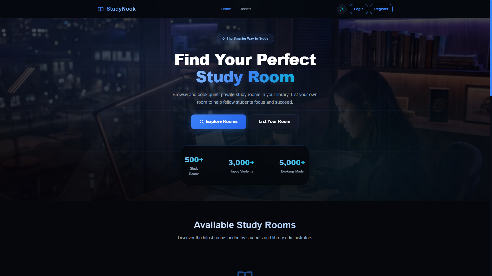

# StudyNook - Library Study Room Booking

StudyNook is a full-stack study room booking application for students and library users. Visitors can explore available rooms, search and filter by room details, view room information, and book a study space for a selected date and time. Authenticated users can also list and manage their own rooms.

## Live Project

- Live site: [https://studynook-client-pi.vercel.app](https://studynook-client-pi.vercel.app)
- Client repository: [https://github.com/actuallyayon/studynook-client](https://github.com/actuallyayon/studynook-client)

## Screenshot



## Technologies Used

| Area | Technologies |
| --- | --- |
| Frontend | React, Vite, React Router |
| Styling | CSS, CSS custom properties, responsive layouts |
| Animation and UI | Framer Motion, React Icons, React Hot Toast |
| API and Auth | Axios, Firebase Authentication, JWT-based backend sessions |
| Backend | Node.js, Express.js, MongoDB, Mongoose |
| Deployment | Vercel |

## Core Features

- Browse the latest study rooms from the home page.
- Search, filter, and paginate available rooms.
- View detailed room information including image, amenities, capacity, floor, hourly rate, and booking count.
- Book a room by selecting date, start time, and end time with automatic total cost calculation.
- Register and log in with email/password or Google authentication.
- Add, edit, and delete owned study room listings.
- Manage personal room listings and bookings from protected dashboard pages.
- Responsive dark/light themed interface with smooth animations and toast feedback.

## Dependencies

Main dependencies:

- `react`
- `react-dom`
- `react-router-dom`
- `axios`
- `firebase`
- `framer-motion`
- `react-hot-toast`
- `react-icons`

Development dependencies:

- `vite`
- `@vitejs/plugin-react`
- `eslint`
- `@eslint/js`
- `eslint-plugin-react-hooks`
- `eslint-plugin-react-refresh`
- `globals`
- `vercel`

## Run Locally

Follow these steps to run the client project on your machine.

1. Clone the repository:

   ```bash
   git clone https://github.com/actuallyayon/studynook-client.git
   ```

2. Move into the project folder:

   ```bash
   cd studynook-client
   ```

3. Install dependencies:

   ```bash
   npm install
   ```

4. Create a local environment file:

   ```bash
   cp .env.example .env
   ```

5. Update `.env` with your API URL and Firebase configuration:

   ```env
   VITE_API_URL=http://localhost:5000
   VITE_FIREBASE_API_KEY=your_firebase_api_key
   VITE_FIREBASE_AUTH_DOMAIN=your_project.firebaseapp.com
   VITE_FIREBASE_PROJECT_ID=your_project_id
   VITE_FIREBASE_STORAGE_BUCKET=your_project.appspot.com
   VITE_FIREBASE_MESSAGING_SENDER_ID=your_sender_id
   VITE_FIREBASE_APP_ID=your_app_id
   ```

6. Start the development server:

   ```bash
   npm run dev
   ```

7. Open the local URL shown in the terminal, usually:

   ```text
   http://localhost:5173
   ```

## Available Scripts

- `npm run dev` - start the Vite development server.
- `npm run build` - create a production build.
- `npm run preview` - preview the production build locally.
- `npm run lint` - run ESLint checks.

## Relevant Resources

- [React documentation](https://react.dev/)
- [Vite documentation](https://vite.dev/)
- [Firebase documentation](https://firebase.google.com/docs)
- [Vercel documentation](https://vercel.com/docs)
